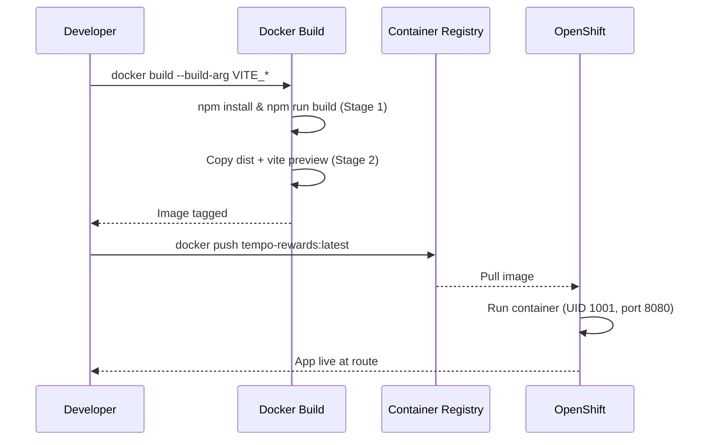

# TeMPO Rewards Tracker

Reconcile technician upsell submissions against gift card reward fulfillments.


## Overview

TeMPO Rewards Tracker is an internal tool for Cableone operations teams that reconciles technician upsell submissions (from the TeMPO system) against gift card fulfillments (from Sendoso). It surfaces mismatches—missing rewards, unmatched records, amount discrepancies—so administrators can ensure every technician gets paid correctly. Technicians use the same app in a read-only capacity to check their reward status.

## Features

- **Restricted authentication** — email/password login locked to `@corp.cableone.net` domain
- **Role-based access control** — separate admin and technician experiences via a dedicated `user_roles` table with Postgres RLS
- **CSV upload & validation** — admins bulk-import TeMPO submission and Sendoso fulfillment data with column mapping and error handling
- **Automated reconciliation** — 1:1 and subset-sum (group) matching algorithms to pair submissions with rewards
- **Technician dashboard** — per-user view with status pipeline, search, sort, and filtering
- **Admin emulation** — "view as" mode lets admins see exactly what a specific technician sees
- **Upload audit trail** — every import is logged with row counts, skipped/updated records, and uploader identity
- **OpenShift-ready deployment** — multi-stage Docker build serving the SPA via `vite preview` on port 8080

## Tech Stack

| Layer          | Technology                                                         |
| -------------- | ------------------------------------------------------------------ |
| Language       | TypeScript 5.8                                                     |
| UI Framework   | React 18, React Router 6                                           |
| Styling        | Tailwind CSS 3, shadcn/ui (Radix primitives)                      |
| State / Data   | TanStack React Query, React Hook Form, Zod                        |
| Charts         | Recharts                                                           |
| Backend        | Supabase (Postgres, Auth, Row-Level Security, Edge Functions)      |
| Build          | Vite 5, SWC                                                       |
| Testing        | Vitest, Testing Library                                            |
| Infrastructure | Docker (multi-stage), OpenShift (arbitrary UID, port 8080)         |

## Getting Started

### Prerequisites

| Tool   | Version | Notes                                   |
| ------ | ------- | --------------------------------------- |
| Node.js | ≥ 22   | Required by Dockerfile; LTS recommended |
| npm    | ≥ 9    | Ships with Node 22                      |

### Installation

```sh
git clone <YOUR_GIT_URL>
cd tempo-rewards
npm install
```

### Environment Variables

Create a `.env` file in the project root (see `.env.example`):

| Variable                         | Required | Description                                      |
| -------------------------------- | -------- | ------------------------------------------------ |
| `VITE_SUPABASE_PROJECT_ID`       | Yes      | Supabase project identifier                      |
| `VITE_SUPABASE_PUBLISHABLE_KEY`  | Yes      | Supabase anon/public API key                     |
| `VITE_SUPABASE_URL`              | Yes      | Supabase API base URL (`https://<id>.supabase.co`) |

All three are inlined by Vite at build time and must also be passed as `--build-arg` during Docker builds.

### Running Locally

```sh
npm run dev
```

The dev server starts at `http://localhost:8080` with HMR enabled.

### Testing

```sh
npm test            # single run
npm run test:watch  # watch mode
```

## Usage

1. **Sign in** at `/auth` with your `@corp.cableone.net` email.
2. **Technicians** land on `/dashboard` and see their submissions, matched rewards, and current status pipeline.
3. **Admins** access `/admin` to upload TeMPO and Sendoso CSV files, trigger reconciliation, manage users, and review upload history.
4. Admins can **emulate** any technician to debug their view without switching accounts.

## Project Structure

```
├── public/                  # Static assets (favicon, robots.txt)
├── src/
│   ├── components/
│   │   ├── ui/              # shadcn/ui primitives (button, card, dialog, etc.)
│   │   ├── EmulationBanner.tsx
│   │   ├── NavLink.tsx
│   │   └── ProtectedRoute.tsx
│   ├── contexts/
│   │   └── EmulationContext.tsx   # Admin "view-as" state
│   ├── hooks/
│   │   ├── useAuth.tsx           # Auth provider & helpers
│   │   └── use-mobile.tsx        # Responsive breakpoint hook
│   ├── integrations/
│   │   └── supabase/             # Auto-generated client & types
│   ├── lib/
│   │   ├── statusStyles.ts       # Status badge color mapping
│   │   └── utils.ts              # Shared utilities (cn, etc.)
│   ├── pages/
│   │   ├── Admin.tsx             # Admin panel (uploads, reconciliation, user mgmt)
│   │   ├── Auth.tsx              # Sign-in / sign-up
│   │   ├── Dashboard.tsx         # Technician dashboard
│   │   └── NotFound.tsx
│   ├── App.tsx                   # Router & provider tree
│   └── main.tsx                  # Entry point
├── supabase/
│   └── config.toml               # Supabase project config
├── Dockerfile                    # Multi-stage build for OpenShift
├── .dockerignore
├── .env.example
├── vite.config.ts
└── package.json
```

## Deployment

This project ships as a Docker image designed for OpenShift but compatible with any container runtime.

### Build

```sh
docker build \
  --build-arg VITE_SUPABASE_PROJECT_ID="your-project-id" \
  --build-arg VITE_SUPABASE_PUBLISHABLE_KEY="your-anon-key" \
  --build-arg VITE_SUPABASE_URL="https://your-project-id.supabase.co" \
  -t tempo-rewards:latest .
```

### Run

```sh
docker run -p 8080:8080 tempo-rewards:latest
```

The container runs as UID 1001 with OpenShift arbitrary-UID support. `vite preview` serves the SPA on port 8080 and handles client-side routing natively.

### Deployment Flow



## License

No license file found in this repository.
